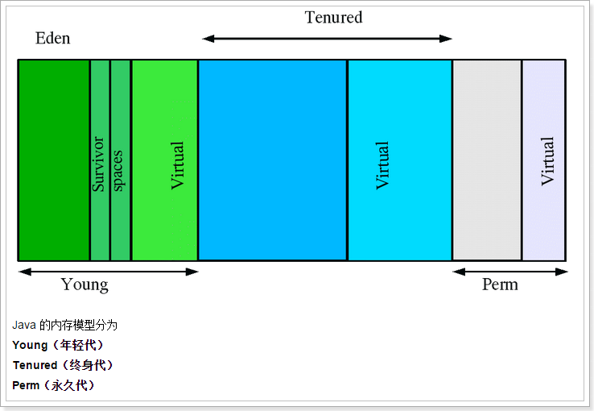
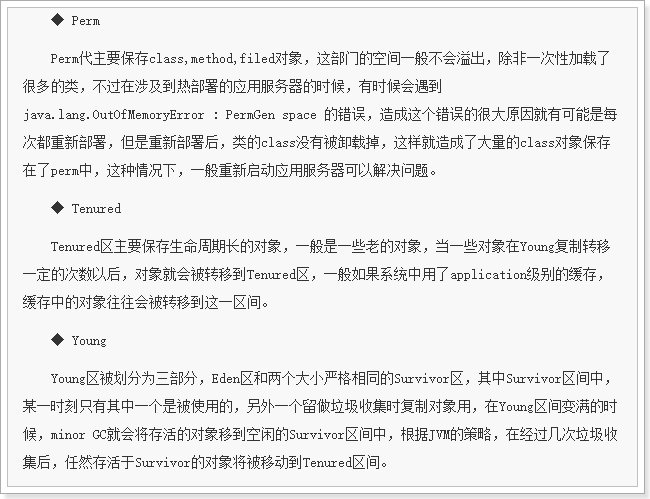
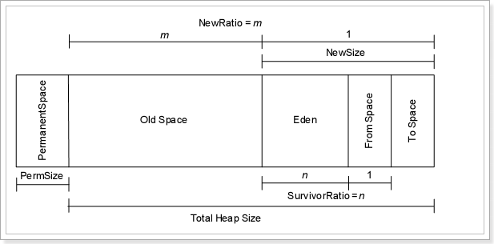
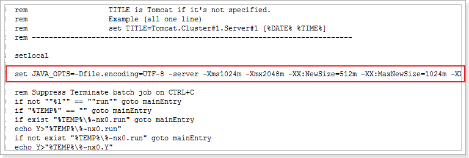
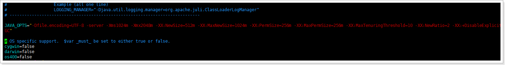

# JVM参数的优化

适当调整Tomcat的运行JVM参数可以提升整体性能。

## JVM内存模型






**当一个URL被访问时，内存申请过程如下：**

> A. JVM会试图为相关Java对象在Eden中初始化一块内存区域 

> B. 当Eden空间足够时，内存申请结束。否则到下一步 

> C. JVM试图释放在Eden中所有不活跃的对象（这属于1或更高级的垃圾回收）, 释放后若Eden空间仍然不足以放入新对象，则试图将部分Eden中活跃对象放入Survivor区 

> D. Survivor区被用来作为Eden及OLD的中间交换区域，当OLD区空间足够时，Survivor区的对象会被移到Old区，否则会被保留在Survivor区 

> E. 当OLD区空间不够时，JVM会在OLD区进行完全的垃圾收集（0级）

> F. 完全垃圾收集后，若Survivor及OLD区仍然无法存放从Eden复制过来的部分对象，导致JVM无法在Eden区为新对象创建内存区域，则出现”out of memory错误”


## JVM参数

**修改文件：bin/catalina.sh**
```xml

JAVA_OPTS="-Dfile.encoding=UTF-8 -server -Xms1024m -Xmx1024m -XX:NewSize=512m -XX:MaxNewSize=512m -XX:PermSize=256m -XX:MaxPermSize=256m -XX:NewRatio=2 -XX:MaxTenuringThreshold=50 -XX:+DisableExplicitGC"
```
参数说明：
```xml

1、	file.encoding 默认文件编码

2、	-Xmx1024m  设置JVM最大可用内存为1024MB

3、	-Xms1024m  设置JVM最小内存为1024m。此值可以设置与-Xmx相同，以避免每次垃圾回收完成后JVM重新分配内存。

4、	-XX:NewSize  设置年轻代大小

5、	XX:MaxNewSize 设置最大的年轻代大小

6、	-XX:PermSize  设置永久代大小

7、	-XX:MaxPermSize 设置最大永久代大小

8、	-XX:NewRatio=4:设置年轻代（包括Eden和两个Survivor区）与终身代的比值（除去永久代）。设置为4，则年轻代与终身代所占比值为1：4，年轻代占整个堆栈的1/5

9、	-XX:MaxTenuringThreshold=0：设置垃圾最大年龄，默认为：15。如果设置为0的话，则年轻代对象不经过Survivor区，直接进入年老代。对于年老代比较多的应用，可以提高效率。如果将此值设置为一个较大值，则年轻代对象会在Survivor区进行多次复制，这样可以增加对象再年轻代的存活时间，增加在年轻代即被回收的概论。

10、	-XX:+DisableExplicitGC这个将会忽略手动调用GC的代码使得 System.gc()的调用就会变成一个空调用，完全不会触发任何GC


```


## 	在tomcat中设置JVM参数


### windows


修改bin/catalina.bat文件设置参数（第一行）
set JAVA_OPTS=-Dfile.encoding=UTF-8 -server -Xms1024m -Xmx2048m -XX:NewSize=512m -XX:MaxNewSize=1024m -XX:PermSize=256m -XX:MaxPermSize=256m -XX:MaxTenuringThreshold=10 -XX:NewRatio=2 -XX:+DisableExplicitGC




### linux

修改bin/catalina.sh文件参数（第一行）
JAVA_OPTS="-Dfile.encoding=UTF-8 -server -Xms1024m -Xmx2048m -XX:NewSize=512m -XX:MaxNewSize=1024m -XX:PermSize=256m -XX:MaxPermSize=256m -XX:MaxTenuringThreshold=10 -XX:NewRatio=2 -XX:+DisableExplicitGC"



