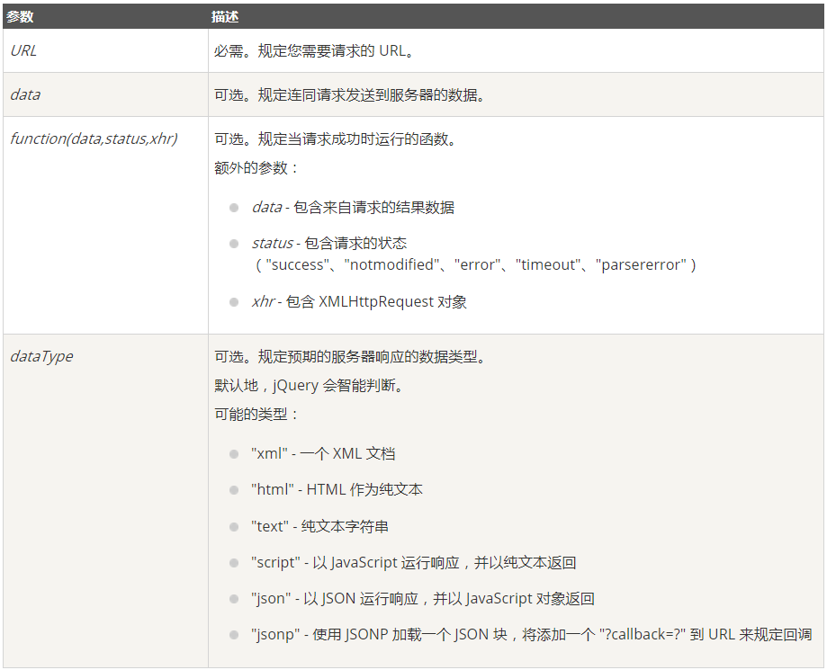

# jQuery Ajax


> **jQuery 提供多个与 AJAX 有关的方法。
通过 jQuery AJAX 方法，您能够使用 HTTP Get 和 HTTP Post 从远程服务器上请求文本、HTML、XML 或 JSON - 同时您能够把这些外部数据直接载入网页的被选元素中。**

**jQuery AJAX 方法**

AJAX 是一种与服务器交换数据的技术，可以在不重新载入整个页面的情况下更新网页的一部分。

下面是常用的 jQuery AJAX 方法

## **jQuery ajax() 方法**

> **执行异步 AJAX 请求**

**定义和用法**

ajax() 方法用于执行 AJAX（异步 HTTP）请求。

所有的 jQuery AJAX 方法都使用 ajax() 方法。该方法通常用于其他方法不能完成的请求。

**语法**
```js
$.ajax({name:value, name:value, ... })
```
该参数规定 AJAX 请求的一个或多个名称/值对。

使用 AJAX 请求改变 <div> 元素的文本：

```js
$("button").click(function(){
    $.ajax({url:"demo_test.txt",success:function(result){
        $("#div1").html(result);
    }});
});
```
下面的表格中列出了可能的名称/值：


## **jQuery - AJAX load() 方法**

> **jQuery load() 方法是简单但强大的 AJAX 方法。
load() 方法从服务器加载数据，并把返回的数据放入被选元素中。**


load()方式是对jquery对象进行操作的。

### **语法:**

```js
$(selector).load(url,data,function(response,status,xhr))
```


**下面的例子会在 load() 方法完成后显示一个提示框。如果 load() 方法已成功，则显示"外部内容加载成功！"，而如果失败，则显示错误消息：**
```html
<!DOCTYPE html>
<html>
<head>
<meta charset="utf-8">
<script src="https://cdn.bootcss.com/jquery/1.10.2/jquery.min.js">
</script>
<script>
$(document).ready(function(){
  $("button").click(function(){
    $("#div1").load("/try/ajax/demo_test.txt",function(responseTxt,statusTxt,xhr){
      if(statusTxt=="success")
        alert("外部内容加载成功!");
      if(statusTxt=="error")
        alert("Error: "+xhr.status+": "+xhr.statusText);
    });
  });
});
</script>
</head>
<body>

<div id="div1"><h2>使用 jQuery AJAX 修改该文本</h2></div>
<button>获取外部内容</button>

</body>
</html>
```

## **jQuery - AJAX get() 和 post() 方法**

> **jQuery get() 和 post() 方法用于通过 HTTP GET 或 POST 请求从服务器请求数据。**


### **HTTP 请求：GET vs. POST**

两种在客户端和服务器端进行请求-响应的常用方法是：GET 和 POST。

* GET - 从指定的资源请求数据

* POST - 向指定的资源提交要处理的数据

GET 基本上用于从服务器获得（取回）数据。注释：GET 方法可能返回缓存数据。

POST 也可用于从服务器获取数据。不过，POST 方法不会缓存数据，并且常用于连同请求一起发送数据。
#### jQuery $.get() 方法
> **$.get() 方法使用 HTTP GET 请求从服务器加载数据。**

**语法：**
```js
$.get(URL,data,function(data,status,xhr),dataType)
```



``` html

<script>
$(document).ready(function(){
	$("button").click(function(){
		$.get("/try/ajax/demo_test.php",function(data,status){
			alert("数据: " + data + "\n状态: " + status);
		});
	});
});
</script>
</head>
<body>

<button>发送一个 HTTP GET 请求并获取返回结果</button>

</body>
</html>
```

#### jQuery $.post() 方法

> **$.post() 方法使用 HTTP POST 请求从服务器加载数据。**

**语法:**
```js
$(selector).post(URL,data,function(data,status,xhr),dataType)
```


```html
$("button").click(function(){
    $.post("/try/ajax/demo_test_post.php",
    {
        name:"菜鸟教程",
        url:"http://www.runoob.com"
    },
        function(data,status){
        alert("数据: \n" + data + "\n状态: " + status);
    });
});
```

## **jQuery getJSON() 方法**

> **使用 HTTP GET 请求从服务器加载 JSON 编码的数据**


**语法**
```js
$(selector).getJSON(url,data,success(data,status,xhr))
```


