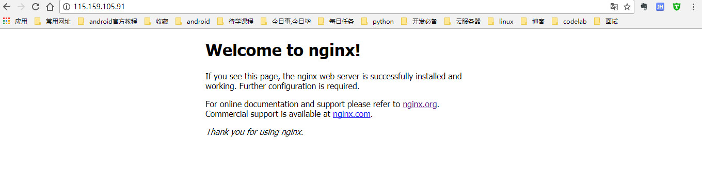

# Ubuntu下nginx的安装配置
---
## 安装命令
```shell
sudo apt-get install nginx
```
**测试:**浏览器访问,出现如下界面安装完成.



## nginx的目录存放位置：

**配置文件目录 /etc/nginx**

**网站资源文件存放位置/usr/share/nginx**


# [Ubuntu16.04安装ftp服务器](http://blog.csdn.net/yancey_blog/article/details/52790451)

## 安装vsftpd

```
sudo apt-get install vsftpd
```

测试: ftp://你的ip

## 通过ftp上传文件到 nginx资源目录

在 **网站资源文件存放位置/usr/share/nginx**,新建一个images的目录

```
mkdir images
```
并修改images目录权限

```
root@VM-44-227-ubuntu:/usr/share/nginx# chmod 777 images
```

这时,便可以使用ftp客户端远程上传文件到nginx的资源目录,并在浏览器通过http进行访问

## VMWare安装centos虚拟机设置网卡NAT连接

使用Putty远程链接centos虚拟机即可

linux命令: 切换用户 

```
su - root 
```

## centos默认启动命令行界面

在 centOS 中的修改方法如下:

1.root登陆，免得老是sudo

2.打开/etc/inittab 文件

   #vim /etc/inittab
3.在默认的 run level 设置中,可以看到第一行书写如:id:5:initdefault:(默认的 run level 等级为 5,即图形
界面)
4.将第一行的 5 修改为 3 即可。

5.保存文件后重启系统你就可以看见是启动的文本界面了。


## centos安装nginx

下载,解压
```
wget http://nginx.org/download/nginx-1.4.2.tar.gz
```
安装之前先安装
```
yum install pcre pcre-devel

和

yum install -y zlib-devel
```


安装nginx,安装到 /usr/local/nginx 目录下
```
 ./configure --prefix=/usr/local/nginx

```

安装目录在 **cd /usr/local/** 下

### 启动

进入nginx目录下

		看到如下4个目录
		./
		 ....conf 配置文件  
		 ... html 网页文件
		 ...logs  日志文件 
		 ...sbin  主要二进制程序


输入命令:
```
./sbin/nginx
```

## VMware虚拟机中的CentOS安装Nginx后本机无法访问的解决办法
	
	具体情况如下
	1。本机能ping通虚拟机
	2。虚拟机也能ping通本机
	3。虚拟机能访问自己的web
	4。本机无法访问虚拟己的web
	后来发现是防火墙将80端口屏蔽了的缘故。


 做如下处理：

```
[root@localhost ]# /sbin/iptables -I INPUT -p tcp --dport 80 -j ACCEPT  
[root@localhost ]# /etc/init.d/iptables save  
[root@localhost ]# /etc/init.d/iptables restart  
```

   至此，OK了，主机已可访问虚拟机的nginx服务。

资源目录在  **cd /usr/local/nginx/** 下面的html目录中

安装sftp服务器

```
yum -y install vsftpd
```


## 异常 
```
Exception in thread "main" org.apache.commons.net.MalformedServerReplyException: Could not parse response code.
Server Reply: SSH-2.0-OpenSSH_6.2
```

原因: 服务器开启的是sftp协议,

连接的协议，我用FTP的客户端工具FileZilla连接是可以成功的，所以一开始就忽略了这方面的问题，去仔细的看了下，

果然，FileZilla连接的host上，是以sftp://开头的，看来这是sftp协议无疑，ftp和sftp还是有本质区别的。知道了原因，换个jar包重新编码，这里使用了jsch-0.1.51.jar，主要连接代码如下：

https://www.dexcoder.com/selfly/article/4028


http://www.cnblogs.com/chen1987lei/archive/2010/11/26/1888384.html


如果要使用ftp链接

需要安装 ftp

```
yum -y install ftp
```

## 开放防护墙端口号

	LINUX开启允许对外访问的网络端口 
	 
	LINUX通过下面的命令可以开启允许对外访问的网络端口： 
	 
	/sbin/iptables -I INPUT -p tcp --dport 8000 -j ACCEPT #开启8000端口 
	 
	/etc/rc.d/init.d/iptables save #保存配置 
	 
	/etc/rc.d/init.d/iptables restart #重启服务 


## centos关闭防火墙 

集群测试
```
@Test
	public void testJedisCluster() {
		HashSet<HostAndPort> nodes = new HashSet<>();
		nodes.add(new HostAndPort("192.168.242.130", 6379));
//		nodes.add(new HostAndPort("192.168.242.130", 6380));
//		nodes.add(new HostAndPort("192.168.242.130", 6381));
//		nodes.add(new HostAndPort("192.168.242.130", 7004));
//		nodes.add(new HostAndPort("192.168.242.130", 7005));
//		nodes.add(new HostAndPort("192.168.242.130", 7006));
		
		JedisCluster cluster = new JedisCluster(nodes);
		
		cluster.set("key1", "1000");
		String string = cluster.get("key1");
		System.out.println(string);
```
报异常信息:

	redis.clients.jedis.exceptions.JedisClusterMaxRedirectionsException: Too many Cluster redirections?	


关闭防火墙即可

```
service iptable stop  //关闭防火墙

chkconfig iptables off  //永久关闭防火墙

 service iptables status  //查看防火墙状态

```


## 查看端口号

```
ps aux|grep redis
```

## 结束端口号进程

```
kill -9 端口号
```
```
 killall redis-server  //结束所有redis-server

```


## 复制文件到

```
cp 文件 文件复制位置

cp 6381/ 6382 -R ..把6381文件下的所有文件复制到6382文件下面

```

## 192.168.242.130安装目录

```
/usr/local/src/redis/redis-3.0.2
```

```
/usr/local/src/redis/redis-3.0.2/src

```

## redis.conf配置文件集群目录

```
/redis
```


