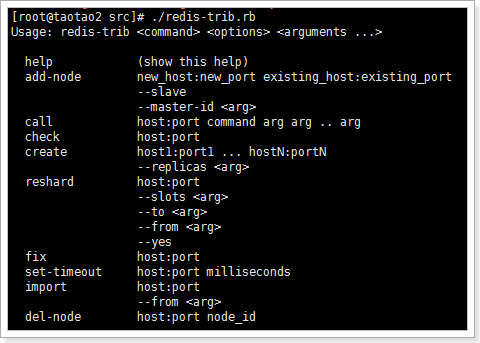
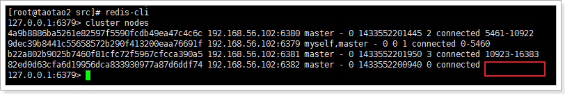

# redis3.0集群特性


# 主从复制（读写分离）

主从复制的好处有2点：

* 1、	避免redis单点故障
* 2、	构建读写分离架构，满足读多写少的应用场景


## 设置主从


创建6379、6380、6381目录，分别将安装目录下的redis.conf拷贝到这三个目录下。
 

分别进入这三个目录，分别修改配置文件，将端口分别设置为：6379（Master）、6380（Slave）、6381（Slave）。同时要设置pidfile文件为不同的路径。


**在redis中设置主从有2种方式：**

* 1、	在redis.conf中设置slaveof
a)	slaveof <masterip> <masterport>

* 2、	使用redis-cli客户端连接到redis服务，执行slaveof命令
a)	slaveof <masterip> <masterport>

第二种方式在重启后将失去主从复制关系。

查看主从信息：INFO replication

主：


**role**：角色

**connected_slaves**：从库数量

**slave0**：从库信息

从：


## 主从从架构


### **从库只读**

> **默认情况下redis数据库充当slave角色时是只读的不能进行写操作。**
> **可以在配置文件中开启非只读：slave-read-only no**

### 	**复制的过程原理**

* 1、	当从库和主库建立MS关系后，会向主数据库发送SYNC命令；

* 2、	主库接收到SYNC命令后会开始在后台保存快照（RDB持久化过程），并将期间接收到的写命令缓存起来；

* 3、	当快照完成后，主Redis会将快照文件和所有缓存的写命令发送给从Redis；

* 4、	从Redis接收到后，会载入快照文件并且执行收到的缓存的命令；

* 5、	之后，主Redis每当接收到写命令时就会将命令发送从Redis，从而保证数据的一致；


### **无磁盘复制**

通过前面的复制过程我们了解到，主库接收到SYNC的命令时会执行RDB过程，即使在配置文件中禁用RDB持久化也会生成，那么如果主库所在的服务器磁盘IO性能较差，那么这个复制过程就会出现瓶颈，庆幸的是，Redis在2.8.18版本开始实现了无磁盘复制功能（不过该功能还是处于试验阶段）。

**原理：**
Redis在与从数据库进行复制初始化时将不会将快照存储到磁盘，而是直接通过网络发送给从数据库，避免了IO性能差问题。

开启无磁盘复制：**repl-diskless-sync yes**


## 复制架构中出现宕机情况，怎么办？

如果在主从复制架构中出现宕机的情况，需要分情况看：

### **1、	从Redis宕机**

		a)	这个相对而言比较简单，在Redis中从库重新启动后会自动加入到主从架构中，自动完成同步数据；
		b)	问题？ 如果从库在断开期间，主库的变化不大，从库再次启动后，
	                  主库依然会将所有的数据做RDB操作吗？还是增量更新？（从库有做持久化的前提下）

> **不会的，因为在Redis2.8版本后就实现了，主从断线后恢复的情况下实现增量复制。**

### **2、	主Redis宕机**

 这个相对而言就会复杂一些，需要以下2步才能完成

		i.	第一步，在从数据库中执行SLAVEOF NO ONE命令，断开主从关系并且提升为主库继续服务；
		ii.	第二步，将主库重新启动后，执行SLAVEOF命令，将其设置为其他库的从库，这时数据就能更新回来；

> **这个手动完成恢复的过程其实是比较麻烦的并且容易出错，有没有好办法解决呢？当前有的，Redis提高的哨兵（sentinel）的功能。**

## **哨兵（sentinel）**

### **什么是哨兵**

顾名思义，哨兵的作用就是对Redis的系统的运行情况的监控，它是一个独立进程。它的功能有2个：

* 1、	监控主数据库和从数据库是否运行正常；
* 2、	主数据出现故障后自动将从数据库转化为主数据库；
###	**原理**

**单个哨兵的架构：**
 


**多个哨兵的架构：**
 


多个哨兵，不仅同时监控主从数据库，而且哨兵之间互为监控。


### **配置哨兵**


启动哨兵进程首先需要创建哨兵配置文件：
```xml
vim sentinel.conf
```
输入内容：
```xml
sentinel monitor taotaoMaster 127.0.0.1 6379 1
```
说明：

		taotaoMaster：监控主数据的名称，自定义即可，可以使用大小写字母和“.-_”符号
		127.0.0.1：监控的主数据库的IP
		6379：监控的主数据库的端口
		1：最低通过票数

启动哨兵进程：
```bash
redis-sentinel ./sentinel.conf
```
 

由上图可以看到：

* 1、	哨兵已经启动，它的id为9059917216012421e8e89a4aa02f15b75346d2b7
* 2、	为master数据库添加了一个监控
* 3、	发现了2个slave（由此可以看出，哨兵无需配置slave，只需要指定master，哨兵会自动发现slave）


### **配置多个哨兵**
```
vim sentinel.conf
```
输入内容：
```
sentinel monitor taotaoMaster 127.0.0.1 6381 2
sentinel monitor taotaoMaster2 127.0.0.1 6381 1
```

# **集群**

即使有了主从复制，每个数据库都要保存整个集群中的所有数据，容易形成木桶效应。

使用Jedis实现了分片集群，是由客户端控制哪些key数据保存到哪个数据库中，如果在水平扩容时就必须手动进行数据迁移，而且需要将整个集群停止服务，这样做非常不好的。

Redis3.0版本的一大特性就是集群（Cluster），接下来我们一起学习集群。

## **架构**


 
* (1)所有的redis节点彼此互联(PING-PONG机制),内部使用二进制协议优化传输速度和带宽.
* (2)节点的fail是通过集群中超过半数的节点检测失效时才生效.
* (3)客户端与redis节点直连,不需要中间proxy层.客户端不需要连接集群所有节点,连接集群中任何一个可用节点即可
* (4)redis-cluster把所有的物理节点映射到[0-16383]slot（插槽）上,cluster 负责维护node<->slot<->value


## 	**修改配置文件**

* 1、	设置不同的端口，6379、6380、6381
* 2、	开启集群，cluster-enabled yes
* 3、	指定集群的配置文件，cluster-config-file "nodes-xxxx.conf"

## **创建集群**

首先，进入redis的安装包路径下：
cd /usr/local/src/redis/redis-3.0.1/src/


执行命令：
```bash
./redis-trib.rb create --replicas 0 192.168.56.102:6379 192.168.56.102:6380 192.168.56.102:6381
```
**--replicas 0：指定了从数据的数量为0**

> **注意：这里不能使用127.0.0.1，否则在Jedis客户端使用时无法连接到！**

redis-trib用法：





### 	**测试**
 


**什么情况？？(error) MOVED 7638 127.0.0.1:6380** 

**因为abc的hash槽信息是在6380上，现在使用redis-cli连接的6379，无法完成set操作，需要客户端跟踪重定向。**
```bash
redis-cli -c
```


## **插槽的分配**

通过cluster nodes命令可以查看当前集群的信息：

 
该信息反映出了集群中的每个节点的id、身份、连接数、插槽数等。

当我们执行set abc 123命令时，redis是如何将数据保存到集群中的呢？执行步骤：

	1、	接收命令set abc 123
	2、	通过key（abc）计算出插槽值，然后根据插槽值找到对应的节点。（abc的插槽值为：7638）
	3、	重定向到该节点执行命令

**整个Redis提供了16384个插槽，也就是说集群中的每个节点分得的插槽数总和为16384。**

**./redis-trib.rb 脚本实现了是将16384个插槽平均分配给了N个节点。**

**注意：如果插槽数有部分是没有指定到节点的，那么这部分插槽所对应的key将不能使用。**

### **插槽和key的关系**

计算key的插槽值：

**key的有效部分使用CRC16算法计算出哈希值，再将哈希值对16384取余，得到插槽值。**

什么是有效部分？

* 1、	如果key中包含了{符号，且在{符号后存在}符号，并且{和}之间至少有一个字符，则有效部分是指{和}之间的部分；
     	a)	key={hello}_tatao的有效部分是hello
* 2、	如果不满足上一条情况，整个key都是有效部分；
		a)	key=hello_taotao的有效部分是全部


### **新增集群节点**

再开启一个实例的端口为6382


执行脚本：
```
./redis-trib.rb add-node 192.168.56.102:6382 192.168.56.102:6379
```
 
已经添加成功！查看集群信息：

 

发现没有插槽数。

接下来需要给6382这个服务分配插槽，将6379的一部分（1000个）插槽分配给6382：

 

 

查看节点情况：


### **删除集群节点**

想要删除集群节点中的某一个节点，需要严格执行2步：

**1、	将这个节点上的所有插槽转移到其他节点上；**

		a)	假设我们想要删除6380这个节点
		b)	执行脚本：./redis-trib.rb reshard 192.168.56.102:6380
		c)	选择需要转移的插槽的数量，因为3380有5128个，所以转移5128个
		d)	输入转移的节点的id，我们转移到6382节点：82ed0d63cfa6d19956dca833930977a87d6ddf7
		e)	输入插槽来源id，也就是6380的id
		f)	输入done，开始转移
		g)	查看集群信息，可以看到6380节点已经没有插槽了。

**2、	使用redis-trib.rb删除节点**

		a)	./redis-trib.rb del-node 192.168.56.102:6380 4a9b8886ba5261e82597f5590fcdb49ea47c4c6c
		b)	del-node host:port node_id
		c)	 
		d)	查看集群信息，可以看到已经没有6380这个节点了。


## 故障机制

	1、	集群中的每个节点都会定期的向其它节点发送PING命令，并且通过有没有收到回复判断目标节点是否下线；
	2、	集群中每一秒就会随机选择5个节点，然后选择其中最久没有响应的节点放PING命令；
	3、	如果一定时间内目标节点都没有响应，那么该节点就认为目标节点疑似下线；
	4、	当集群中的节点超过半数认为该目标节点疑似下线，那么该节点就会被标记为下线；
	5、	当集群中的任何一个节点下线，就会导致插槽区有空档，不完整，那么该集群将不可用；
	6、	如何解决上述问题？
	a)	在Redis集群中可以使用主从模式实现某一个节点的高可用
	b)	当该节点（master）宕机后，集群会将该节点的从数据库（slave）转变为（master）继续完成集群服务；

## 集群中的主从复制架构
架构：
 


出现故障：


## 4.9.3.	创建主从集群
需要启动6个redis实例，分别是：
6379（主） 6479（从）
6380（主） 6480（从）
6381（主） 6481（从）

 

启动redis实例：
```
cd 6379/ && redis-server ./redis.conf && cd ..
cd 6380/ && redis-server ./redis.conf && cd ..
cd 6381/ && redis-server ./redis.conf && cd ..
cd 6479/ && redis-server ./redis.conf && cd ..
cd 6480/ && redis-server ./redis.conf && cd ..
cd 6481/ && redis-server ./redis.conf && cd ..
```
 

创建集群，指定了从库数量为1，创建顺序为主库（3个）、从库（3个）：
```
./redis-trib.rb create --replicas 1 192.168.56.102:6379 192.168.56.102:6380 192.168.56.102:6381 192.168.56.102:6479 192.168.56.102:6480 192.168.56.102:6481
```
 
 


创建成功！查看集群信息：


