# tomcat 优化操作

> 目的:通过优化tomcat提高网站的并发能力。


## 配置tomcat管理员账户

在conf/ tomcat-users.xml下添加用户：

```xml
<role rolename="manager"/>
<role rolename="manager-gui"/>
<role rolename="admin"/>
<role rolename="admin-gui"/>
<user username="tomcat" password="tomcat" roles="admin-gui,admin,manager-gui,manager"/>
```
启动tomcat，登录查看信息：
http://127.0.0.1:8080/

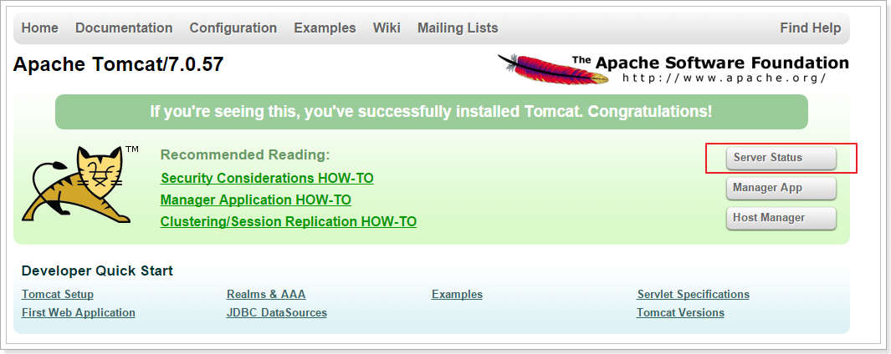

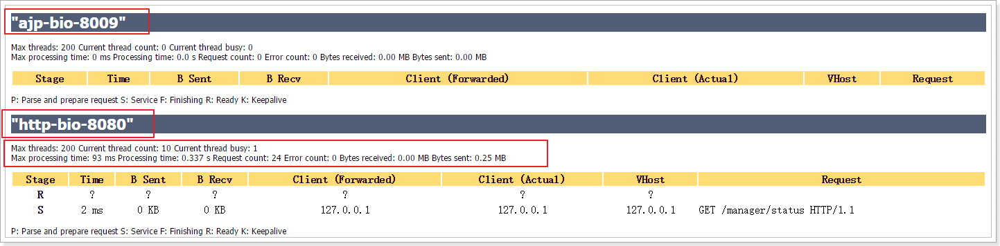


## tomcat的3种运行模式

tomcat的运行模式有3种：

1、	**bio**

默认的模式,性能非常低下,没有经过任何优化处理和支持.

2、	**nio**

利用java的异步io护理技术,no blocking IO技术.

3、	**apr**

安装起来最困难,但是从操作系统级别来解决异步的IO问题,大幅度的提高性能.


## 优化一:启动NIO模式

修改server.xml里的Connector节点,修改protocol为org.apache.coyote.http11.Http11NioProtocol
 

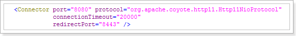

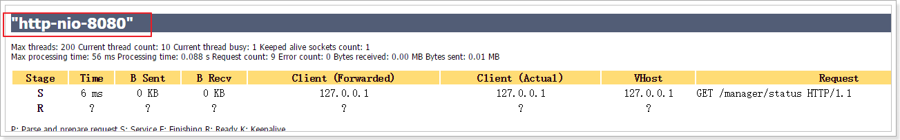

## 优化二:执行器（线程池）

在tomcat中每一个用户请求都是一个线程，所以可以使用线程池提高性能。

### 开启并且使用

配置

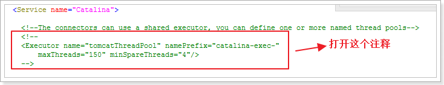

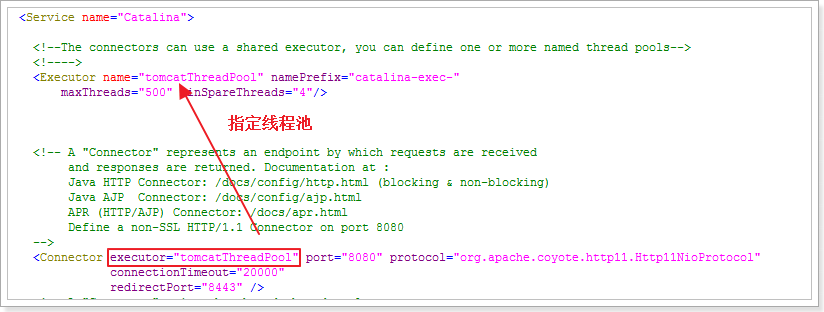


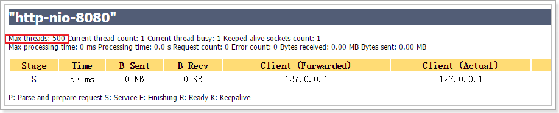

### 参数说明

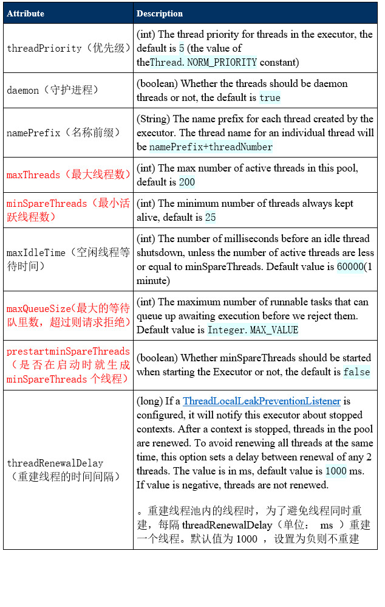


最佳实践:

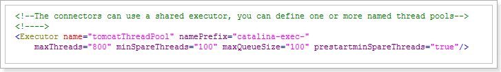


###  NIO的具体配置

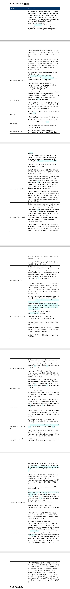

最佳实践:

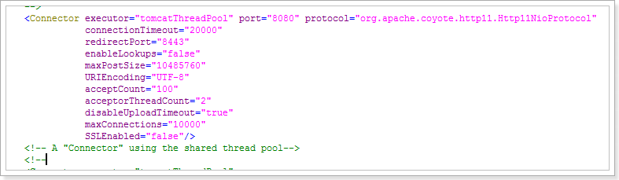

## 优化三:禁用AJP连接器

AJP（Apache JServer Protocol）
AJPv13协议是面向包的。WEB服务器和Servlet容器通过TCP连接来交互；为了节省SOCKET创建的昂贵代价，WEB服务器会尝试维护一个永久TCP连接到servlet容器，并且在多个请求和响应周期过程会重用连接。

我们一般是使用Nginx+tomcat的架构，所以用不着AJP协议，所以把AJP连接器禁用。

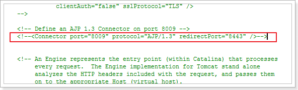

在管理界面中看不到ajp了.